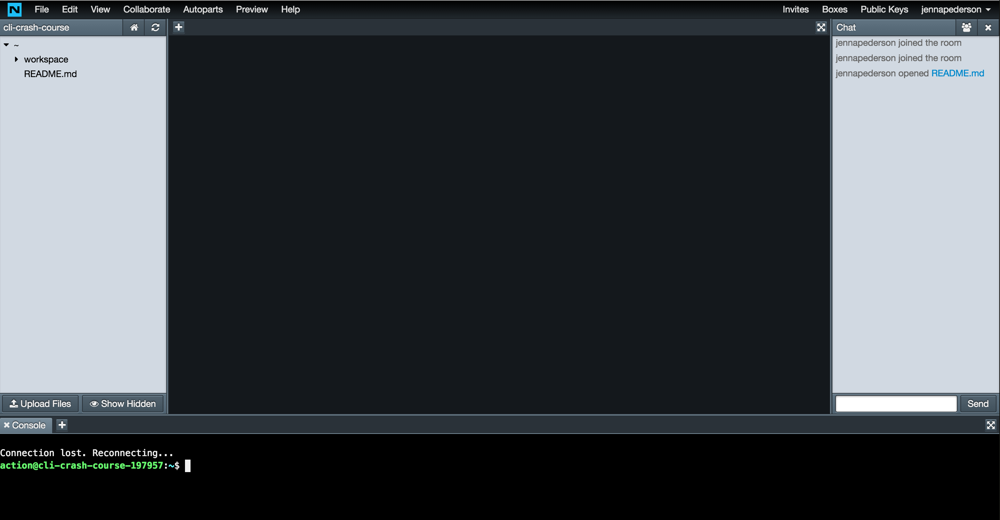

# Windows or Chromebook

If you're using Windows or a Chromebook (or even an [iPad](http://help.nitrous.io/coding-on-ipad/)), your best option and the one that we will be supporting during this workshop is to use [Nitrous.io](https://www.nitrous.io/join/MommurvvT9A?utm_source=nitrous.io&utm_medium=copypaste&utm_campaign=referral).

## Use Nitrous.io

[Nitrous.io](https://www.nitrous.io/join/MommurvvT9A?utm_source=nitrous.io&utm_medium=copypaste&utm_campaign=referral) is an excellent way to "code in the cloud". It lets you quickly spin up a "box" with your favorite development environment already installed and lets you share it with others. This approach is done right in your browser. This is FREE unless you want extra options, space, etc, which you will not need for this workshop.

1. Go to [Nitrous.io](https://www.nitrous.io/join/MommurvvT9A?utm_source=nitrous.io&utm_medium=copypaste&utm_campaign=referral) and create an account if you don't already have one or just sign in
1. After signing in, go to the dashboard (a list of your Boxes) by clicking the green button for the Dashboard or the Boxes link in the top menu
1. Click the orange New Box button
1. Select the Node.js template (we will not be using Node.js but this template will give us access to the CLI tools for this workshop)
1. Give the box a name (or use the silly one that Nitrous generates)
1. Leave the other settings at their default
1. Click the orange Create Box button
1. Nitrous will create the box and start it up for you (this is known as provisioning)
1. You're done when you get here:

## Now you're ready for the workshop. See you there!